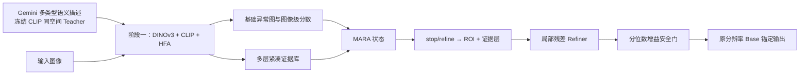

# SRA-DINO 最新技术总结

> 更新日期：2026-09-03
> 对应代码：当前工作区最新实现

## 1. 项目概述

SRA-DINO 是一个面向零样本异常检测的两阶段框架。主线第一阶段利用冻结的 DINOv3 和 CLIP 建立基础检测器；新增实验线完全移除 CLIP/Text Tower，直接在 DINO 空间学习多正常/异常视觉原型。第二阶段冻结所选基础模型，由 MARA Agent 根据异常图、不确定性、多层分数和压缩视觉证据进行多步局部精炼。

项目的核心目标是：**保留可靠的基础预测，只对预计具有正增益的局部区域进行受约束修改。**

## 2. 第一阶段：基础异常检测器

### 2.1 模型组成

- 视觉主干：冻结的 DINOv3 ViT-L/16；
- 文本主干：冻结的 CLIP ViT-L/14-336 文本编码器；
- 特征抽取层：DINOv3 第 5、11、17、23 层；
- HFA：层内残差瓶颈适配器，主流水线默认 `hfa3`，即注入第 11、17、23 层；
- 视觉适配：逐层 CLS/Patch 投影适配器；
- 文本适配：正常/异常文本投影与类别无关的可学习提示。

### 2.2 基础输出

每个视觉层产生三类结果：

1. **Patch—Text 跨模态异常图**：Patch 与正常/异常文本特征匹配，提供主要像素级定位结果；
2. **CLS—Patch 异常感知图**：通过局部 Patch 与全局 CLS 的相关性强化异常区域感知；
3. **CLS—Text 图像级分数**：输出整图正常/异常分类 logits。

多层结果平均后形成基础异常图和图像级分数。第一阶段联合优化异常感知、像素分割与图像分类；奖励引导的分类困难样本重加权处于启用状态，分割权重 `w_seg` 当前固定为 1。

### 2.3 CLIP 同空间多语义锚点

正常/异常提示上下文 `ctx_pos`、`ctx_neg` 仍为可学习参数。Gemini 3.5 Flash 只负责提供可审计的自然语言描述，当前语义库分别包含 6 条正常和 6 条异常描述，覆盖结构完整、表面纹理、缺失/多余部件、形变、污染和异物等模式。训练启动时使用项目中同一个冻结 CLIP 文本编码器把描述库编码为 Teacher bank；历史 Gemini Embedding 数值仅保留为来源记录，不进入训练坐标。

可学习提示先经过完整 CLIP Transformer 和 EOS 投影得到检测实际使用的最终文本特征 $t_n,t_a$。定义 Teacher bank 中心 $a_n,a_a$、提示方向 $d_p=\operatorname{norm}(t_a-t_n)$ 和 Teacher 方向 $d_t=\operatorname{norm}(a_a-a_n)$，锚点损失为：

$$
\mathcal L_{anchor}=\lambda_{dir}[1-\cos(d_p,d_t)]
+\frac{\lambda_{pair}}{2}\sum_{c\in\{n,a\}}[1-\cos(t_c,a_c)]
+\lambda_{sep}\max(0,m_{adapt}-[1-\cos(t_n,t_a)])
+\lambda_{bank}\mathcal L_{multi+}.
$$

其中 $\mathcal L_{multi+}$ 把同类多描述作为正样本、异类描述作为负样本；$m_{adapt}$ 综合 Teacher 间隔和语义初始化后的提示间隔，并由配置上限 $m$ 截断，避免配对项把正常/异常提示拉得过近。模块没有额外可训练 projector，梯度直接通过冻结 CLIP Transformer 回传到提示 token。

P1 还使用多描述的 CLIP token embedding 交错初始化 20 个正常/异常 context token，替代完全随机初始化；可通过 `--disable_semantic_anchor_init` 单独关闭以进行消融。

### 2.4 DINO 单塔实验分支

`train_dino_single.py` 提供不依赖 CLIP 的实验性基础检测器。冻结的 DINOv3 输出第 5、11、17、23 层 CLS/Patch token，每层经空间保持适配器投影到 256 维。4 个正常视觉原型和 8 个异常视觉原型通过 Cross-Attention 读取当前图像 Patch，再用多原型余弦匹配产生各层异常图。可学习层权重融合多层像素 logits，CLS margin 与 Top-K Patch margin 共同形成图像级 logits。

视觉原型头联合优化像素 Focal/Dice、逐层辅助分割、图像分类、原型多样性/分离和正常图像假阳性约束。默认不启用 HFA，因此 DINOv3 保持严格冻结，第一阶段可使用双卡 DDP。该分支的检查点以 `base_arch=dino_single` 标识，MARA 训练与评估会自动重建正确的基础模型，不加载 CLIP 权重。

## 3. 阶段一紧凑证据库

最新实现不再只向 MARA 提供多层最终异常概率，而是从冻结的阶段一模型提取紧凑证据。设视觉层数为 $L$，证据包括：

| 证据 | 通道数 | 含义 |
|---|---:|---|
| `layer_maps` | $L$ | 各层 Patch—Text 异常概率图，供层选择动作使用 |
| 跨模态 margin | $L$ | 异常与正常文本匹配差值 |
| 异常感知图 | $L$ | CLS—Patch 异常响应 |
| 正常相似度 | $L$ | Patch 与正常文本相似度 |
| 异常相似度 | $L$ | Patch 与异常文本相似度 |
| 跨层分歧图 | 2 | 跨模态图和异常感知图的逐像素标准差 |
| 全局 margin | $L$ | 各层 CLS 的异常—正常分数差 |

空间附加证据共 $4L+2$ 个通道，全局证据共 $L$ 维。默认 $L=4$ 时，MARA 接收：

- 4 张可选择的层级异常图；
- 18 个附加空间证据通道；
- 4 维全局层级 margin。

证据在基础模型冻结和 `no_grad` 条件下生成，并在进入 Agent 前完成归一化和压缩。CLIP 主线仍不传递原始高维 Patch 特征。DINO 单塔实验线额外把每层特征学习压缩为 8 个空间通道，因此默认四层会向 MARA 增加 32 个视觉证据通道，同时避免直接传递 1024 维 Patch 特征造成显存爆炸。

## 4. 第二阶段：MARA-GRPO

### 4.1 状态与层级动作

MARA 状态由以下内容拼接：

$$
s_t=[P_t^{anom},H(P_t),P_0^{anom},t/T,M^1,\ldots,M^L,E],
$$

其中 $E$ 为紧凑空间证据库。默认四层配置下，状态编码器输入为 26 个通道。

每一步执行条件层级动作：

$$
stop/refine \rightarrow (ROI,\ layer).
$$

- `stop`：停止当前轨迹；
- `refine`：从候选 ROI 中选择一个区域，并选择一张层级跨模态异常图作为显式证据；
- ROI/层的 log-probability 和 entropy 只在 `refine` 时参与策略优化。

候选区域由高异常响应和高预测熵位置各提供一半。默认在 $128\times128$ 决策图上生成 16 个、边长 32 的固定方形 ROI。

### 4.2 局部精炼与 Base 锚定

Refiner 接收完整状态、选中的层级异常图和 ROI 掩码，输出两通道 logit 残差及空间更新门。修改受到以下约束：

- 仅作用于选中 ROI；
- 残差受 `delta_scale` 限幅；
- 门控受 `gate_max` 限幅；
- 多步门控采用概率并集式累积；
- 最终概率始终与冻结的 Base 输出融合。

最新实现直接在原始分辨率上执行最终融合：

$$
P_{final}=P_{base}(1-G)+P_{proposal}G.
$$

当 $G=0$ 时，输出与原始 Base 概率逐元素完全一致，避免低分辨率下采样—上采样造成的无修改误差。推理会额外报告 `identity_error_mean/max` 验证这一性质。

### 4.3 质量函数与增量奖励

训练质量函数为：

$$
Q_t=0.5Q_{cls}+1.0Q_{loc}+0.0Q_{conf}-0.2Q_{fp}.
$$

当前默认配置重点优化图像分类、像素定位和正常区域假阳性抑制，置信度奖励项保留但默认关闭。单步奖励为：

$$
r_t=Q_{t+1}-Q_t-c_{step}-\mathbb{1}[refine]c_{refine}.
$$

步成本和精炼成本分别默认为 0.001 和 0.002，用于抑制无效步骤与过度修改。

### 4.4 Base 锚定 GRPO

每张图默认采样 4 条轨迹，其中一条为严格零修改 Base 轨迹。该轨迹的所有奖励和回报均为 0，并从策略梯度中排除。其他轨迹使用 Base 锚定优势：

$$
A_t=\operatorname{clip}\left(
\frac{R_t-R_t^{base}-m}{\sigma_{group,t}+\epsilon},
-A_{max},A_{max}
\right).
$$

组内样本用于估计归一化尺度，但优势正负由相对 Base 的绝对增益决定，因此低于 Base 的轨迹不会仅因优于其他较差轨迹而获得正优势。策略更新采用 PPO/GRPO 截断比率、KL 约束和熵正则。

### 4.5 反事实分位数增益门控

每一步先生成不受安全门控制的候选更新，再利用真实质量变化构造反事实增益目标。增益模块同时学习：

- 增益均值回归；
- 增益是否为正的二分类；
- 0.1 分位数增益下界；
- `stop/refine` 辅助目标；
- 增益符号与接受概率一致性。

推理时仅当

$$
\widehat q_{0.1}(g_t)>m_{safe}
\quad\text{且}\quad
p_{accept}\ge0.50
$$

才执行精炼；否则拒绝候选并结束轨迹。训练前 5 个 epoch 为增益预热期，非 Base 轨迹被强制精炼以训练 Refiner 和增益预测器，之后再启用 GRPO。

## 5. 训练目标

### 5.1 阶段一

$$
\mathcal L_{stage1}=0.25\mathcal L_{aw}+0.5\mathcal L_{seg}
+0.25(\mathcal L_{global}+\lambda_{anchor}\mathcal L_{anchor}).
$$

主流水线检测到锚点文件后默认 $\lambda_{anchor}=0.20$，因此锚点损失在总损失中的有效系数为 0.05；文件不存在时默认关闭，不影响原流程。

### 5.2 阶段二

MARA 联合优化：

$$
\mathcal L=
0.7\mathcal L_{seg}
+0.3\mathcal L_{global}
+0.05\mathcal L_{normal\_consistency}
+0.5(\mathcal L_{GRPO}+0.01\mathcal L_{KL})
+\mathcal L_{safe}
-0.01\mathcal H(\pi).
$$

$\mathcal L_{safe}$ 包括门控稀疏、增益回归/分位数/分类、增益一致性和操作辅助损失。基础检测器、DINOv3、CLIP、提示和阶段一适配器在第二阶段全部冻结，仅更新 MARA。

## 6. 当前实现效果

当前代码已实现以下能力：

1. **提示语义约束**：语义初始化后的提示由冻结 CLIP 同空间多描述 Teacher 持续校正；
2. **证据增强决策**：MARA 同时利用多层异常概率、跨模态 margin、正常/异常相似度、异常感知和跨层分歧；
3. **安全多步精炼**：Base 锚定优势、反事实增益和分位数硬门共同限制退化；
4. **零门控严格恒等**：未执行修改时，最终输出与原始分辨率 Base 结果完全一致；
5. **可诊断评估**：同时输出 Base、MARA、Delta、安全指标和证据 Oracle 上界；
6. **多 GPU 流程**：MARA 训练支持 DDP，跨数据集测试支持多 GPU 并行任务；
7. **向后兼容**：旧 checkpoint 缺少新证据或分位数头时，可根据 checkpoint 配置退回兼容路径。

## 7. 评估体系

正式结果包含 F1、Image AUROC、Pixel AUROC 和 PRO，并比较 Base、MARA 与 Delta。安全评估额外报告：

- 平均质量增益；
- Base 退化率；
- 负增益接受率；
- 精炼尝试、执行和拒绝步数；
- 门控强度与实际修改比例；
- 预测增益均值和下界；
- 零门控恒等误差。

评估还计算 **Evidence Oracle**：使用 GT 从 Base、各层跨模态异常图和异常感知图中选择质量最好的结果，用于判断现有证据是否包含潜在提升空间。Oracle 只作为诊断上界，不是可部署结果，也不能作为 MARA 的正式性能。

退化和负增益统计默认使用 $10^{-4}$ 容差，避免浮点微小误差被计为真实性能下降。

## 8. 主流水线默认配置

| 配置 | 默认值 |
|---|---:|
| 基础训练数据 | VisA |
| HFA | `hfa3`：11/17/23 层 |
| 特征/证据层 | 5/11/17/23 |
| 语义锚点 | Gemini 描述库 + 冻结 CLIP 同空间 Teacher，正常/异常各 6 条 |
| 锚点权重 / margin | 0.20 / 0.20（锚点文件存在时） |
| 方向 / 配对 / 多正样本 / 分离权重 | 1.00 / 0.10 / 0.25 / 0.50 |
| 多正样本温度 / 语义初始化 | 0.07 / 默认开启 |
| MARA epoch | 30 |
| DDP 进程数 | 2 |
| 每 GPU batch | 2 |
| 最大决策步数 | 3 |
| 每图轨迹数 | 4 |
| 轨迹重放次数 | 3 |
| 决策图大小 | 128 |
| ROI 数量/尺寸 | 16 / 32 |
| 残差尺度/门控上限 | 0.50 / 0.35 |
| 增益预热 | 5 epoch |
| 增益下界分位数 | 0.10 |
| 接受概率阈值 | 0.50 |
| 测试数据集 | MVTec AD / BTAD / MPDD |

## 9. 核心创新点

1. **CLIP 同空间多语义锚点**：由外部大模型生成多类型描述，再用冻结 CLIP 构建 Teacher bank，通过方向、配对和多正样本约束直接校正最终提示特征；
2. **阶段一多源紧凑证据复用**：把冻结基础检测器的多层概率、语义 margin、相似度、异常感知和跨层分歧统一提供给第二阶段；
3. **证据条件的层级 MARA 策略**：联合决定是否修改、修改区域和参考层，而不是固定平均多层结果；
4. **严格 Base 锚定 GRPO**：使用同图像零修改轨迹确定优势符号，直接优化相对基础模型的增益；
5. **反事实分位数安全门**：以不受门控影响的候选质量训练增益下界，推理只接受保守估计为正的修改；
6. **原分辨率恒等安全保证**：零门控时绕过低分辨率重采样误差，严格恢复 Base 输出；
7. **证据 Oracle 与退化指标联合诊断**：区分“证据本身无提升空间”和“Agent 未能正确选择证据”。
8. **离线 8B FP8 视觉教师蒸馏**：两张 GPU 各加载一份 Qwen3-VL-8B-FP8，对互斥数据分片生成异常概率、ROI、动作、层偏好与置信度；随后卸载 VLM，只把这些决策蒸馏到 DINO 侧轻量语义头。
9. **语义决策显式供给 MARA**：蒸馏头输出语义先验图、置信图、与 Base 的分歧图，以及动作/层级/图像异常概率向量；MARA 因而能读取比单一异常图更完整的中间决策证据。

这些贡献的重点是“多源证据利用、动态决策和保守安全机制”的组合，而不是单独宣称首次使用 DINOv3、CLIP 或强化学习进行异常检测。

## 10. 当前边界

- `train_mara.py` 默认 `train_split=test`，当前属于 supervised/transductive 训练设置；若用于严格零样本结论，应采用互斥辅助数据训练与校准，目标数据仅测试；
- 证据源通过通道拼接进入状态，当前离散动作只显式选择层级跨模态异常图，尚未单独选择“相似度/异常感知/分歧”等证据类型；
- 候选 ROI 是固定尺寸 Top-K 方框，没有 NMS、多尺度或边界候选；
- CLIP 主线仍不包含原始高维 Patch 特征；DINO 单塔仅传递每层 8 通道学习压缩特征，压缩维度需要进一步消融；
- DINO 单塔属于新增实验分支，当前代码完成了结构与梯度验证，但尚不能在没有正式跨数据集实验前声明优于 CLIP 主线；
- Qwen3-VL 是训练期离线 Teacher，不参与最终推理；其伪标签质量、正常参考图选择和 prompt 仍需通过 `RUN_VLM_DISTILL=0` 对照及缓存统计验证；
- 多描述 Teacher 仍是类别无关语义，是否应进一步加入类别条件描述需要通过跨数据集消融确定；
- 语义初始化、方向损失和多正样本损失的实际收益仍需分别与 `anchor_weight=0` 对照验证；
- 仓库未包含最新 MARA checkpoint 或评估结果文件，因此本文只总结已实现能力，不声明具体数值提升。

## 11. 代码索引

| 文件 | 职责 |
|---|---|
| `train.py` | 第一阶段基础检测器训练 |
| `train_dino_single.py` | DINO 单塔视觉原型检测器双卡训练 |
| `tools/dino_single_tower.py` | 多层空间适配、图像条件视觉原型、单塔异常图、压缩视觉证据与轻量语义决策头 |
| `tools/vlm_decision.py` | Qwen3-VL prompt、严格 JSON 解析、ROI/热图构造与 vLLM 推理封装 |
| `build_vlm_decision_cache.py` | 两卡独立 FP8 Teacher 分片缓存、断点续跑与合并 |
| `train_vlm_distiller.py` | 不读取 GT 的 VLM 决策蒸馏、双卡 DDP 与语义 checkpoint 输出 |
| `tools/semantic_anchor.py` | 描述库加载、冻结 CLIP Teacher 编码、语义初始化和多锚点损失 |
| `tools/build_gemini_semantic_anchors.py` | Gemini 描述生成、多类型描述库及来源记录构建 |
| `tests/test_semantic_anchor.py` | 同空间方向损失、梯度、margin 和描述库测试 |
| `tools/utils_up.py` | 阶段一多层异常输出与证据导出 |
| `tools/mara_evidence.py` | 紧凑证据库构建、归一化与 Oracle 候选 |
| `tools/mara_agent.py` | MARA 状态、层级策略、Refiner、GRPO 和安全门控 |
| `train_mara.py` | 证据生成、轨迹采样/重放、DDP 与联合损失训练 |
| `test_mara.py` | Base/MARA/Oracle 指标和安全行为评估 |
| `train_mara_visa.sh` | 两阶段训练与跨数据集评估流水线 |
| `run_exp.sh` | DINO Base、双卡 VLM 缓存、语义蒸馏、MARA 与跨数据集测试一体化实验 |

## 12. 总结

最新 SRA-DINO 保留 CLIP 同空间 Teacher 主线，同时新增 DINO 单塔对照：直接在视觉空间学习多正常/异常原型，消除跨模态投影，并把压缩 Patch 特征交给 MARA。单塔实验还可使用 Qwen3-VL-8B-FP8 作为一次性的离线视觉教师，把高层判断蒸馏为轻量语义证据，而不把大模型带入部署。两条 Base 路线共享 Base 锚定 GRPO 和反事实分位数安全门，从而可以用严格消融判断文本语义、纯视觉密集特征与 VLM 决策先验各自的实际贡献。
