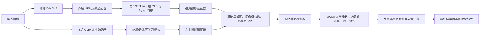

# SRA-DINO 技术总结

> 本文依据当前仓库代码整理，重点描述相对上游 AD-DINOv3 基线新增的两阶段训练与 MARA-GRPO 异常图精炼机制。文中的“创新”指本项目实现层面的方法设计亮点，不等同于经过完整文献检索后的学术首创性结论。

## 1. 一句话概括

SRA-DINO 是一个面向零样本异常检测的两阶段视觉—语言框架：第一阶段在冻结的 DINOv3 与 CLIP 主干上，通过层内瓶颈适配器、视觉/文本投影和可学习正常/异常提示完成基础检测器校准；第二阶段冻结整个基础检测器，将异常图后处理建模为“区域选择—特征层选择—停止/精炼”的多步决策过程，并使用 GRPO 式策略优化、反事实增益预测和基线锚定安全门控，只在预计能改善结果时对局部异常图进行保守修正。

## 2. 项目目标与问题定义

项目处理 Zero-Shot Anomaly Detection（ZSAD），同时输出：

- 像素级异常概率图，用于异常定位与分割；
- 图像级正常/异常分数，用于异常分类；
- 对未参与基础检测器训练的新类别或新数据集保持迁移能力。

基础 AD-DINOv3 已解决两个核心问题：DINOv3 视觉特征与异常检测文本语义之间的模态/领域偏差，以及 CLS 全局语义容易掩盖细粒度缺陷的问题。本项目进一步关注两个不足：

1. 固定地平均多层异常图，无法针对不同图像、不同缺陷动态选择最有效的语义层和局部区域；
2. 直接用可学习网络重写整张异常图容易破坏基础检测器已经正确的预测，跨类别或跨数据集时尤其明显。

因此，整体方法采用“先校准、后决策精炼”的解耦式两阶段设计。

## 3. 总体技术路线

两个阶段的职责边界非常清晰：

- 阶段一学习“如何把通用视觉—语言特征校准到异常检测空间”；
- 阶段二学习“对当前样本是否需要改、改哪里、参考哪一层、何时停止”。

## 4. 第一阶段：基础 SRA-DINO 检测器

### 4.1 冻结双基础模型，进行参数高效校准

视觉侧使用 DINOv3 ViT-L/16，文本侧使用 CLIP ViT-L/14-336 的文本编码器。两个大模型主体均冻结，只训练轻量模块：

- DINOv3 指定 Transformer 层中的 HFA 残差瓶颈适配器；
- 每个抽取层对应的 CLS/Patch 特征投影适配器；
- 正常与异常文本特征的投影适配器；
- 类别无关的浅层可学习提示上下文。

HFA 的残差形式为：

$$
\operatorname{HFA}(x)=x+\alpha W_{up}\,\sigma(W_{down}x),
$$

其中默认特征维度为 1024、瓶颈维度为 256，缩放系数以 $10^{-3}$ 初始化。适配器通过前向 Hook 注入 DINOv3 第 5、11、17、23 层，并提供 `none`、单层以及 `hfa1`—`hfa4` 的层级消融配置。小尺度残差初始化使训练从原始 DINOv3 表示附近开始，降低破坏预训练能力的风险。

### 4.2 类别无关的正常/异常可学习提示

文本分支分别维护正常提示与异常提示，模板核心为 `object` 和 `damaged object`，并在其前面学习独立的上下文 token。当前默认提示长度为 20、深度为 1，即只使用浅层提示而关闭深层 compound prompt。

该设计的作用是：

- 不依赖测试类别名称，保留跨类别零样本迁移属性；
- 正常与异常上下文独立学习，扩大二者在文本嵌入空间中的可分性；
- CLIP 主体冻结，避免小规模异常数据破坏通用语言知识。

### 4.3 多层、三分支异常建模

系统从多个 DINOv3 中间层提取 CLS token 与 Patch token，经适配器映射到 768 维并归一化。每层产生三类输出：

1. **Patch—Text 跨模态异常图**：每个 Patch 分别与正常、异常文本向量计算相似度并进行二分类 Softmax，得到主要的像素级异常概率；
2. **CLS—Patch 异常感知图（AACM 路径）**：计算 Patch 与全局 CLS 的相关性，用监督信号促使全局表示关注异常区域，而非只关注通用前景；
3. **CLS—Text 图像级分数**：CLS 与正常/异常文本向量匹配，得到整图二分类 logits。

最终对各层输出求平均，兼顾浅层局部纹理与深层语义信息。第二阶段还会保留每一层独立的跨模态异常图，不再只使用平均结果。

### 4.4 联合监督与奖励引导的困难样本重加权

基础训练目标为：

$$
\mathcal{L}_{base}=0.25\mathcal{L}_{aware}+0.5\mathcal{L}_{seg}+0.25\mathcal{L}_{global},
$$

其中像素级分支使用 Focal Loss 与 Dice Loss，图像级分支使用交叉熵。

代码还计算由正确类别概率、异常区域 Soft Dice 和正确预测置信度组成的样本奖励，并维护跨 batch 的 EMA 奖励基线。分类权重采用

$$
w_{cls}=\operatorname{clip}\left(1-\alpha(R-b),\,0.5,\,2.0\right),
$$

因此低于奖励基线的困难样本获得更高的分类损失权重。需要准确说明的是：当前 `train.py` 在得到分割权重后又将 `w_seg` 置为 1，所以实际启用的是**奖励引导的图像级困难样本重加权**；代码中基于 Dice 难度的分割重加权逻辑目前处于显式关闭状态。该机制属于 reward-guided reweighting，不是完整强化学习；真正的序列强化学习位于第二阶段。

## 5. 第二阶段：MARA-GRPO 多步强化学习精炼

MARA（Multi-step Anomaly Refinement Agent）把静态异常图修正转化为有限步马尔可夫决策过程。基础检测器、DINOv3、CLIP、提示学习器和全部基础适配器在此阶段完全冻结，仅训练 MARA Agent，从而将“基础表征学习”和“决策式后处理”解耦。

### 5.1 强化学习建模

#### 状态

第 $t$ 步状态由下列空间图按通道拼接：

$$
s_t=[P_t^{anom},\ H(P_t),\ P_0^{anom},\ t/T,\ M^1,\ldots,M^L],
$$

其中：

- $P_t^{anom}$：当前异常概率图；
- $H(P_t)$：二分类预测熵，表示像素级不确定性；
- $P_0^{anom}$：冻结基础检测器的原始异常图，是显式安全参照；
- $t/T$：归一化步数平面；
- $M^1,\ldots,M^L$：各 DINOv3 抽取层独立产生的异常图。

状态同时编码了当前结果、原始结果、不确定区域、处理进度和多尺度语义证据，使策略能够根据样本自适应决策，而不是使用固定层融合权重。

#### 候选区域

每一步从当前异常图的高响应位置和高熵位置各选一半中心点，生成固定大小的 ROI 候选。默认在 $128\times128$ 决策分辨率上构造 16 个、边长 32 的候选框。区域特征由状态编码特征在 ROI 内做掩码池化，并拼接归一化框坐标。

这种“异常优先 + 不确定性优先”的候选机制同时覆盖明显缺陷和模型拿不准的潜在缺陷，避免对全图进行昂贵且高风险的自由修改。

#### 联合动作

每一步执行联合离散动作：

$$
a_t=(a_t^{region},a_t^{layer},a_t^{op}),
$$

分别表示：

- 从候选 ROI 中选择一个区域；
- 从多层异常图中选择一个参考层；
- 选择 `stop` 或 `refine`。

动作采用条件层级分解：先选择 `stop/refine`；只有 `refine` 时，ROI 与证据层的对数概率和熵才进入策略目标。`stop` 会终止该轨迹的后续决策，也不会再给无关的区域头和层选择头注入策略梯度，因而模型能更干净地学习空间定位、语义层选择和自适应计算深度。

### 5.2 局部残差精炼与基线锚定

Agent 将完整状态、被选层异常图和被选 ROI 掩码送入轻量卷积 Refiner，输出两类量：

- 两通道 logit 残差 $\Delta_t$；
- 稀疏空间更新门 $g_t$。

残差只在所选 ROI 内生效，并受 `delta_scale` 限幅；更新门经 Sigmoid 后还受 `gate_max` 限幅。多步门控采用概率并集式累积：

$$
G_t=1-(1-G_{t-1})(1-g_t).
$$

最终结果不是无约束地覆盖基础图，而是始终与基础预测 $P_0$ 锚定融合：

$$
P_{t+1}=(1-G_t)P_0+G_t\,\operatorname{softmax}(z_t+\Delta_t).
$$

图像级 logits 也采用同类的基线锚定更新。当前训练脚本默认 `gate_max=0.35`、`delta_scale=0.50`、`gate_init_bias=-2.0`，并将残差头零初始化，使 Agent 从小幅修改基线开始学习，同时避免旧配置下门控过小导致近似恒等映射。这是一种显式的保守策略：强化学习负责决定是否以及在哪里修改，但修改幅度由结构本身限制。

### 5.3 质量函数与增量奖励

训练时定义阶段质量：

$$
Q_t=\lambda_c Q_{cls}+\lambda_l Q_{loc}+\lambda_h Q_{conf}-\lambda_f Q_{fp}.
$$

各项含义为：

- $Q_{cls}=-\operatorname{CE}$：图像级分类质量；
- $Q_{loc}$：异常样本使用 Soft Dice，正常样本使用 $1-\operatorname{mean}(P^{anom})$；
- $Q_{conf}=1-H/\log2$：图像级预测置信度；
- $Q_{fp}$：正常像素上的平均异常响应，用于惩罚假阳性。

单步奖励采用“质量增量”而不是绝对质量：

$$
r_t=Q_{t+1}-Q_t-c_{step}-\mathbb{1}[refine]c_{refine}.
$$

该设计具有三点意义：

1. 优化目标直接对应“相对基础结果是否改善”；
2. 每步成本与精炼成本抑制无效反复修改；
3. 分类、定位、正常图抑假阳性被统一到同一个可比较的序列收益中。

默认脚本权重为 $\lambda_c=0.5$、$\lambda_l=1.0$、$\lambda_h=0$、$\lambda_f=0.2$，折扣因子 $\gamma=0.95$。

### 5.4 面向异常图精炼的 GRPO 式策略优化

对每张输入图复制 $G$ 次并采样 $G$ 条轨迹，默认组大小为 4。系统计算每一步的折扣回报：

$$
R_t=\sum_{k=t}^{T-1}\gamma^{k-t}r_k,
$$

当前实现不再只对同组轨迹做均值中心化，而是以组内强制保留的零修改 Base 轨迹为绝对锚点，得到安全优势：

$$
A_t^{anchor}=\operatorname{clip}\left(\frac{R_t-R_t^{base}-m}{\sigma_{group,t}+\epsilon},-A_{max},A_{max}\right).
$$

归一化尺度仍由同图像的有效非 Base 轨迹估计，但优势的符号由“是否超过 Base 与安全边界”决定。因此，一条绝对劣于 Base 的轨迹不会仅因比同组其他坏轨迹稍好而得到正优势。该方式无需额外 value network，同时保留按图像归一化的稳定性。采样得到的行为轨迹会固定动作并重放多次，采用 PPO 风格的截断比率目标：

$$
\mathcal{L}_{GRPO}=-\mathbb{E}\left[\min(\rho_tA_t,\operatorname{clip}(\rho_t,1-\epsilon,1+\epsilon)A_t)\right].
$$

训练中同时加入近似 KL 约束和策略熵奖励，限制策略更新幅度并保持探索。需要区分：这里的策略优势采用组内相对回报，不使用 value critic；后述 `gain_head` 是用于判断一次修改是否安全的增益预测器，而非 GRPO 的状态价值基线。

### 5.5 基础轨迹锚点

默认情况下，每张图的轨迹组中有一条轨迹在第一步被强制选择 `stop`，从而显式保留“不做任何精炼”的基础方案。该轨迹不参与策略梯度，其全部分步奖励与回报被严格设为 0，不再扣除决策步成本；它作为其余候选轨迹同图像、同条件下的真实基准。

这一设计比用跨 batch 的移动平均基线更贴合目标：策略只有在相对原始检测器更好时才能获得正的组内优势，可降低 Agent 为追求训练奖励而系统性偏离基础模型的风险。

### 5.6 反事实增益预测与双重安全门控

这是第二阶段最关键的安全创新。每一步先构造一个**不受增益门控影响的反事实候选更新**，用标注计算其真实即时增益：

$$
g_t^*=\operatorname{clip}(Q_t^{candidate}-Q_t-c_{refine}).
$$

随后使用同一 Refiner 隐特征训练：

- `gain_head` 回归增益大小，使用 Smooth L1；
- `gain_accept_head` 判断增益是否为正，使用二元交叉熵；
- 一致性损失约束“预测增益符号”和“接受概率”一致；
- 辅助操作损失直接监督 `stop/refine` 头匹配反事实增益正负。

训练前若干 epoch 为增益预热期，先学习 Refiner 与增益判断；预热时除 Base 轨迹外强制执行 `refine`，确保残差头、空间门和增益头获得足够的候选修改监督，之后才打开 GRPO 项。软门控阶段用接受概率缩放更新，且接受权重被 `detach`，避免分割/分类梯度把所有增益预测都推成正值。

增益模型同时预测条件均值与默认 0.1 分位数下界，并使用 pinball loss 训练下界头。推理时使用更严格的硬门控：只有当

$$
\widehat q_{0.1}(g_t)>m_{safe}\quad\text{且}\quad p_{accept}\ge \tau
$$

时才真正执行更新；默认安全边界为 0、接受阈值为 0.50。若精炼被拒绝，轨迹停止，后续步骤不再修改。旧 checkpoint 不包含分位数头时会自动退回原均值增益门控，保持向后兼容。这使系统能够在没有 GT 标签和掩码的推理阶段，借助训练好的反事实增益模型近似判断“改动是否值得”。

### 5.7 监督学习与强化学习的混合目标

MARA 并非只依靠稀疏策略奖励，而是联合优化：

$$
\begin{aligned}
\mathcal{L}_{MARA}={}&w_s\mathcal{L}_{seg}+w_g\mathcal{L}_{global}
+w_b\mathcal{L}_{normal\_consistency}\\
&+w_r(\mathcal{L}_{GRPO}+\beta\mathcal{L}_{KL})
+w_{sp}\lVert G\rVert_1\\
&+w_v\mathcal{L}_{gain}+w_c\mathcal{L}_{gain\_consistency}
+w_o\mathcal{L}_{op}-\eta\mathcal{H}(\pi).
\end{aligned}
$$

其中正常样本一致性损失只惩罚最终异常图相对基础图的漂移，门控 L1 鼓励稀疏修改。该混合目标让像素监督提供稳定梯度，让 GRPO 学习不可微的区域/层/停止决策，同时用安全正则守住基础性能。

## 6. 第二阶段强化学习创新点汇总

1. **把异常图后处理建模为真正的多步联合决策**：策略同时选择局部区域、DINO 特征层和停止/精炼操作，而非学习一张静态融合权重图。
2. **以多层异常图作为可选择的环境证据**：不同缺陷可动态使用浅层纹理或深层语义，替代固定平均多层输出。
3. **异常—不确定性双驱动的候选 ROI**：在有限动作空间内兼顾高响应缺陷与高熵疑难区域，提高探索针对性。
4. **以每步质量增量构造密集奖励**：分类、异常定位、正常样本质量和假阳性惩罚统一进入 $Q_{t+1}-Q_t$，并加入计算/精炼成本学习何时停止。
5. **按图像、按步骤计算组内相对优势**：消除样本固有难度造成的回报尺度差异，无需额外 value network 即可进行稳定的 GRPO 式更新。
6. **引入“零修改”基础轨迹作为同图像锚点**：让策略直接和冻结基础检测器比较，而不是只和其他随机精炼轨迹比较。
7. **反事实增益监督**：先评估一个不受接受门控制约的候选更新，再用其真实质量增量训练增益回归与接受分类，避免门控自我监督形成闭环偏差。
8. **训练软门控、推理硬门控的安全机制**：训练时保留可学习性，推理时只有同时通过增益幅值与接受概率阈值才修改；拒绝后立即终止。
9. **结构级保守更新**：局部 ROI、残差限幅、门控上限、零初始化、基线锚定融合和正常样本一致性共同限制性能退化。
10. **冻结基础模型的模块化第二阶段**：MARA 可作为独立精炼器挂接在已训练的基础检测器上，训练和评估均可直接比较 Base/MARA/Delta 指标。

## 7. 关键默认配置

| 模块 | 默认值 | 作用 |
|---|---:|---|
| DINO 抽取层 | 5, 11, 17, 23 | 提供多层 CLS/Patch 与层级异常图 |
| HFA 瓶颈 | 256 | 参数高效视觉域适配 |
| MARA 最大步数 | 3 | 限制序列长度与推理开销 |
| GRPO 组大小 | 4 | 每图采样的相对比较轨迹数 |
| 行为轨迹重放轮数 | 3 | 提高样本利用率 |
| 决策图尺寸 | 128 | 降低 Agent 空间计算量 |
| 候选 ROI 数量/尺寸 | 16 / 32 | 控制区域动作空间 |
| PPO/GRPO 截断系数 | 0.2 | 限制策略更新幅度 |
| 折扣因子 | 0.95 | 聚合多步长期收益 |
| 步成本/精炼成本 | 0.001 / 0.002 | 抑制无效步骤和过度修改 |
| 残差尺度/门控上限 | 0.50 / 0.35 | 限制单次修改强度并避免近似恒等更新 |
| 增益预热 | 5 epoch | 先学会判断候选修改质量 |
| 增益保守分位数 | 0.10 | 用候选增益下界而非均值进行安全放行 |
| 推理接受阈值 | 0.50 | 与增益下界联合使用的分类门槛 |

## 8. 训练与推理流程

### 训练

1. 运行 `train.py`，训练 HFA、视觉/文本适配器和浅层提示，保存基础 checkpoint；
2. 运行 `train_mara.py`，加载并冻结基础 checkpoint；
3. 对每张训练图采样轨迹组，记录联合动作、旧策略概率、分步奖励和组内优势；
4. 固定动作重放轨迹，联合更新监督精炼损失、GRPO 策略损失与增益安全损失；
5. 每个 epoch 保存完整 MARA checkpoint。

`train_mara_visa.sh` 已把“基础训练—MARA 训练—最终评估”串成一条流水线。

### 推理

推理只需要图像、基础异常图、图像级 logits 和多层异常图，不读取标签或 GT 掩码。默认使用贪心策略；每步先提出区域/层/操作，再经增益硬门控决定是否执行。`test_mara.py` 同时报告基础结果、MARA 结果和增量，指标包括 F1、图像级 AUROC、像素级 AUROC 与 PRO，并记录门控强度、修改比例、精炼/拒绝步数和预测增益。

## 9. 实现边界与结果解读注意事项

- **训练期并非无标注**：阶段一和阶段二都使用图像标签及像素掩码；“零样本”主要指向未见类别/数据集迁移。`train_mara.py` 默认 `train_split=test`，代码也明确将其标为 supervised/transductive protocol。若在同一数据集同一划分上训练并测试，会产生数据泄漏；规范的跨域实验应在辅助数据集训练，在互斥目标数据集测试。
- **推理期无标注**：`MARAAgent.infer()` 不接收标签和掩码，训练期的 GT 只用于奖励、反事实增益目标和监督损失。
- **当前仓库未包含 MARA 实验结果文件**：现有代码具备 Base/MARA/Delta 的完整评估逻辑，但不能仅凭实现宣称第二阶段已经取得特定数值提升，应以实际 checkpoint 的跨域评测结果为准。
- **第一阶段分割奖励权重当前被关闭**：`train.py` 将计算出的 `w_seg` 重置为全 1；若论文或汇报声称使用奖励自适应分割加权，需要先恢复该逻辑并补充消融实验。
- **候选区域是轻量启发式生成**：当前使用 Top-K 异常/熵中心与固定方形 ROI，没有去重或 NMS；其优点是简单高效，潜在问题是候选重叠和对尺度变化不敏感。
- **README 仍主要描述上游 AD-DINOv3**：SRA/HFA/MARA-GRPO 的完整贡献应以本文和当前代码为准，正式发布前建议同步更新项目 README。

## 10. 代码索引

| 文件 | 主要职责 |
|---|---|
| `train.py` | 第一阶段基础检测器训练、奖励重加权、HFA 配置与 checkpoint 保存 |
| `tools/bottleneckAdapter.py` | DINOv3 层内残差瓶颈适配器及 Hook 注入 |
| `tools/promptLearner.py` | 正常/异常浅层可学习提示 |
| `tools/utils.py` | 第一阶段多层特征、三分支异常输出与奖励权重 |
| `train_mara.py` | 冻结基础检测器、采样/重放轨迹、混合损失训练与保存 |
| `tools/mara_agent.py` | 状态、候选 ROI、联合策略、局部精炼、GRPO、增益门控与推理 |
| `tools/utils_up.py` | 提供第二阶段所需的逐层异常图与调试输出 |
| `test_mara.py` | Base/MARA/Delta 对照评估及门控行为统计 |
| `train_mara_visa.sh` | 两阶段训练与最终评估的一体化流水线 |

## 11. 最精炼的贡献表述

SRA-DINO 在 AD-DINOv3 的视觉—语言异常对齐基础上，加入了 DINOv3 层内参数高效适配与奖励引导的困难样本训练；进一步提出 MARA-GRPO，将异常定位精炼建模为区域、层级和停止操作的多步联合决策。其核心不是无约束生成新异常图，而是通过同图像组内相对策略优化、零修改基础轨迹、反事实增益预测和硬安全门控，在冻结基础检测器的前提下学习“只对有把握带来增益的局部区域进行有限修正”。

## 12. 相关论文对照与创新边界（2024—2026）

### 12.1 第一阶段所处位置

- [AD-DINOv3](https://arxiv.org/abs/2509.14084) 已经采用冻结 DINOv3 与 CLIP 文本特征、Patch/CLS 双粒度表示和轻量适配器进行零样本异常检测。因此，“DINOv3 + CLIP + Adapter”本身不宜作为 SRA-DINO 的核心新颖性，项目更应强调层内 HFA 适配方式、三分支异常证据以及与第二阶段精炼的衔接。
- [PALADIN（CVPRW 2026）](https://openaccess.thecvf.com/content/CVPR2026W/VAND/html/Basaran_PALADIN_Prompt-Aligned_Localization_and_Anomaly_Detection_with_DINOv3_CVPRW_2026_paper.html) 同样围绕冻结 DINOv3/CLIP、跨模态适配、合成像素监督与少样本记忆库展开，和阶段一非常接近。这进一步说明，继续简单叠加视觉—文本适配器的边际创新价值有限。
- [VisualAD（CVPR 2026）](https://arxiv.org/abs/2603.07952) 展示了不依赖文本描述的视觉正常/异常 token 与空间对齐路线；[FB-CLIP（CVPR 2026）](https://arxiv.org/abs/2603.19608) 则专门处理前景—背景分离和背景误响应。二者提示阶段一可以增加与文本分支正交的视觉证据和背景抑制证据，但更适合作为第二阶段的可选证据源，而不是再做固定融合。

### 12.2 第二阶段所处位置

- “用强化学习逐步精炼分割”已有明确先例：[Iteratively-Refined Interactive 3D Medical Image Segmentation（CVPR 2020）](https://openaccess.thecvf.com/content_CVPR_2020/html/Liao_Iteratively-Refined_Interactive_3D_Medical_Image_Segmentation_With_Multi-Agent_Reinforcement_Learning_CVPR_2020_paper.html) 已把不确定性放入状态，并使用相对分割质量改变量构造奖励；[AlignSAM（CVPR 2024）](https://arxiv.org/abs/2406.00480) 也用强化学习 Agent 迭代提示冻结的 SAM。因此，MARA 不应只宣称“首次用多步 RL 做异常图精炼”。
- MARA 更有辨识度的组合是：**异常/不确定性双驱动候选区域 + 动态 DINO 层选择 + stop/refine 决策 + 同图像基础轨迹 + 反事实增益门控**。其中“选择哪一层证据”和“预测修改是否真的优于冻结基线”是最值得继续加强的两个点。
- [DLVP-CLIP（CVPR 2026）](https://openaccess.thecvf.com/content/CVPR2026/papers/Zhang_DLVP-CLIP_Enhancing_Fine-Grained_Zero-Shot_Anomaly_Detection_via_Dynamic_Local_Visual_CVPR_2026_paper.pdf) 已提出按图像动态选择高响应局部特征作为提示，并结合频率分解；这意味着 MARA 若仅在最终 logits 上做局部残差修改，理论故事会弱于“根据动作路由特征证据并重新计算局部分数”。
- [MRAD（ICLR 2026）](https://arxiv.org/abs/2602.00522) 使用图像级/像素级特征—标签记忆进行动态检索和提示注入。该路线可以为 MARA 增加一个显式的“检索证据源”，使 Agent 不只在已有多层异常图之间选择。

## 13. 本轮已修正的强化学习关键问题

以下问题会直接影响“基础轨迹锚定”和“安全改进”的真实性，现已在当前分支实现并加入针对性测试。

### 13.1 `base_anchor_margin` 不再被组内中心化抵消

旧实现先计算

$$
R'_{i,t}=R_{i,t}-m,
$$

再按同一图像的轨迹组做中心化。由于每条轨迹减去相同常数，实际得到

$$
R'_{i,t}-\overline{R'_t}=R_{i,t}-\overline{R_t},
$$

所以旧实现中的 `base_anchor_margin` 不会影响策略优势，只影响日志中的 `quality_gain`，训练没有真正要求精炼结果超过基础模型一个安全边际。

当前已改成显式的基线锚定优势：

$$
A^{anchor}_{i,t}=\frac{R_{i,t}-R^{base}_{t}-m}{\sigma_t+\epsilon},
$$

并保证只要轨迹绝对劣于基础轨迹，其策略优势就不能因为“比同组其他坏轨迹稍好”而变成正值。组内样本只负责估计归一化尺度，优势符号由绝对 Base 锚点控制。

### 13.2 “零修改”基础轨迹已严格设为零回报

旧奖励会对被强制为 `stop` 的基础轨迹扣除 `step_cost`，使它成为被人为降低的基线。当前 Base 轨迹定义为：不执行精炼、立即终止、所有分步奖励与 return-to-go 均为 0；它仍可提供反事实候选用于增益头监督，但不参与策略梯度。

### 13.3 `stop` 动作已移除无关的区域/层梯度

旧联合 log-probability 始终为

$$
\log\pi(r)+\log\pi(l)+\log\pi(o),
$$

即使 $o=stop$ 时，区域 $r$ 和层 $l$ 根本不会影响状态转移，这会给区域头和层选择头注入无效策略梯度。当前采用 `op → (ROI, layer)` 的条件层级目标：只有 `refine` 时才累计 ROI/层的 log-probability 与 entropy；对应单元测试验证了全 `stop` 动作下只有操作头收到策略梯度。

### 13.4 第一阶段像素奖励加权实际上被关闭

`train.py` 虽然计算了 `w_seg`，随后又把它重置为全 1。若阶段一贡献包含“奖励引导的困难像素/样本训练”，需要恢复该逻辑或把论文表述收缩为只对分类损失重加权，并补做开/关消融。

## 14. CER-MARA 当前落地与后续路线

建议将下一版研究主线收敛为 **CER-MARA：Conservative Evidence-Routing Multi-step Anomaly Refinement**，即“保守证据路由的多步异常精炼”。重点不是增加更多静态 Adapter，而是让 Agent 决定**何时改、改哪里、使用哪类证据、在多大尺度上改，并在缺乏可靠增益时退回基础结果**。

### 14.1 P0（已落地）：把相对 GRPO 改成真正的基线安全优化

1. 强制基础轨迹的相对回报已严格设为 0；
2. 已使用 $R-R_{base}-m$ 构造锚定优势，避免“相对没那么差”的轨迹获得正优势；
3. 保留 PPO/GRPO 截断，并增加“负增益接受率”和“相对 Base 退化率”训练监控；
4. 动作目标已改为 `op → (ROI, evidence/layer)` 的条件层级结构；
5. 尺度动作和更细粒度的动作头反事实优势尚未实现，留作多尺度候选版本继续推进。

[Safe Policy Improvement with an Estimated Baseline Policy](https://arxiv.org/abs/1909.05236) 的思想可用于设计“不确定时复现基础策略”的保守约束，但其理论保证不能直接照搬到当前深度网络场景，应将其作为目标设计依据而非理论定理。

### 14.2 P0（第一版已落地）：把单点增益预测升级为分布式安全门控

当前实现保留均值 `gain_head`，并新增 0.1 分位数回归头，以 pinball loss 学习候选增益的保守下界，仅在下界满足条件时执行：

$$
q_{0.1}(g_t\mid s_t,a_t)>m_{safe}.
$$

这比“均值大于 0”更能抑制跨域时的偶然高估；测试结果同时输出 `GainPred` 与 `GainQ10`。下一步仍可比较轻量集成、均值—方差头或多个分位数。[Safe Distributional Reinforcement Learning](https://arxiv.org/abs/2102.13446) 支持用收益分布、尾部风险或坏状态概率表达安全性；[Conformal Prediction for Zero-Shot Models](https://arxiv.org/abs/2505.24693) 则提示可用独立校准集调整接受阈值。实际使用时需明确校准集与目标测试集互斥，并单独报告域偏移下的覆盖率和错误接受率。

### 14.3 P1：从“logit 局部修补”升级为“特征证据路由”

建议为每个候选区域准备多种可选证据：

- DINOv3 不同层的局部 Patch 特征与异常图；
- VisualAD 风格的纯视觉正常/异常 token 相似度图；
- MRAD 风格的正常/异常检索记忆图；
- CLIP 文本提示专家或前景—背景分离图；
- 高频/低频纹理证据。

策略选择证据源和层后，通过局部 cross-attention 或动态局部提示重新计算 ROI 的异常分数，而不是直接给旧 logits 加一个自由残差。这样每个动作都具有更清晰的“选择证据—更新判断”语义，也更容易做可视化和消融。

### 14.4 P1：多尺度、去重和边界感知的候选区域

当前固定 32×32 方形 ROI 容易重复覆盖同一热点，也无法兼顾划痕、大片污渍和细小缺口。建议：

- 对异常/熵峰值做 NMS 或基于连通域、超像素生成候选；
- 为每个中心提供多尺度窗口，使尺度成为动作的一部分；
- 增加边界熵、前景概率、背景泄漏率和连通域统计到状态；
- 对主要错误集中在轮廓附近的候选，仅修改边界环带；
- 奖励中加入 boundary F1/Boundary IoU 或背景假阳性惩罚。

[RefineMask（CVPR 2021）](https://openaccess.thecvf.com/content/CVPR2021/html/Zhang_RefineMask_Towards_High-Quality_Instance_Segmentation_With_Fine-Grained_Features_CVPR_2021_paper.html) 说明细粒度特征和边界感知的多阶段精炼对高质量掩码很重要；FB-CLIP 则说明背景误响应本身值得作为独立证据和惩罚项。

### 14.5 P1：用合成异常课程训练 Refiner 与 Gate

[AnomalyVFM（CVPR 2026）](https://arxiv.org/abs/2601.20524) 强调大规模、多样化合成异常数据和置信度加权像素损失；PALADIN 也使用正常目标数据与合成像素监督。建议按以下课程训练：

1. 用已知位置、尺度、类型的合成异常预训练局部 Refiner、增益分布头和尺度选择；
2. 在互斥的辅助真实数据上训练 GRPO；
3. 在另一组互斥类别/数据集上校准安全阈值；
4. 最终目标数据集只测试，不使用其 `test` 掩码参与训练或调参。

这一步既可提高动作覆盖面，也能修复当前 `train_split=test` 默认配置带来的 supervised/transductive 解释风险。

### 14.6 P2：频率动作与提示专家作为按域可选扩展

- [FE-CLIP（ICCV 2025）](https://openaccess.thecvf.com/content/ICCV2025/html/Gong_FE-CLIP_Frequency_Enhanced_CLIP_Model_for_Zero-Shot_Anomaly_Detection_and_ICCV_2025_paper.html) 和 DLVP-CLIP 都表明频率信息对细粒度纹理异常有帮助。可以把高频/低频证据作为 Agent 可选动作，但不宜强制用于所有医学或低纹理场景。
- [Bayes-PFL（CVPR 2025）](https://arxiv.org/abs/2503.10080) 与 [FAPrompt（ICCV 2025）](https://arxiv.org/abs/2410.10289) 分别从提示分布和数据依赖异常先验提高提示多样性。可建立正常/异常提示专家池，让 Agent 根据图像和 ROI 选择专家；优先级仍低于安全优势、候选区域和特征证据路由。

## 15. 建议的消融与安全评估

建议按以下顺序递增实验，避免一次加入过多模块后无法解释增益来源：

| 实验 | 关键变化 | 要回答的问题 |
|---|---|---|
| A | 当前 MARA | 原始基线 |
| B | 严格零回报 Base + 锚定优势 | GRPO 是否真正优于冻结 Base |
| C | 层级条件动作 | 是否降低无效梯度并减少步数 |
| D | 分布式增益头 + 保守下界门控 | 是否降低错误接受和跨域退化 |
| E | 多尺度 NMS 候选 + 边界/背景状态 | 是否改善小缺陷、轮廓和假阳性 |
| F | 视觉/检索/文本多证据路由 | Agent 选择证据是否优于固定融合 |
| G | 合成课程 + 完全互斥跨域协议 | 提升是否能在无泄漏设置下保持 |

除 Image AUROC、Pixel AUROC、PRO、F1 外，第二阶段必须额外报告：

- MARA 相对 Base 的平均增益、最差数据集/类别增益；
- **Base 退化率**：MARA 指标或单样本质量低于 Base 的比例；
- **负增益接受率**：Gate 接受但真实候选增益小于 0 的比例；
- Gate 覆盖率、拒绝率和校准误差；
- 平均精炼步数、实际修改面积、吞吐量和延迟；
- 不同 ROI 尺度、证据源、DINO 层的动作分布与可视化。

## 16. 调研后的结论

最值得投入的方向不是继续堆叠阶段一 Adapter，而是把第二阶段做成真正可靠的 **CER-MARA**：以严格基础轨迹为绝对锚点，用层级策略选择区域、尺度和证据源，在特征空间完成可解释的局部更新，再通过分布式增益下界决定是否接受。该路线既回应了现有代码中“组内相对更好但仍可能差于 Base”的缺口，也能与已有的动态提示、频率增强、记忆检索和迭代分割工作形成清晰区分。
